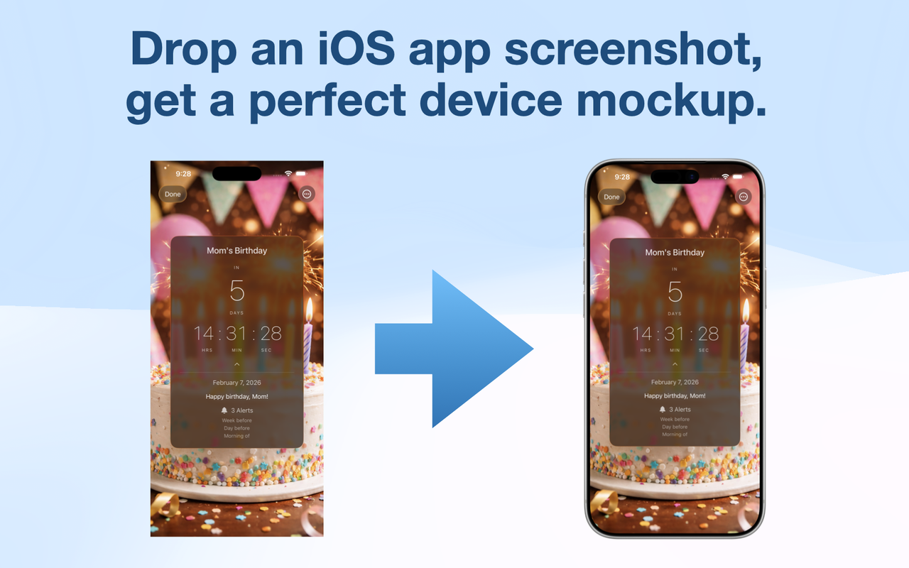

# Bezelbub



A macOS app that wraps your screenshots in realistic Apple device bezels. Drop in a screenshot, and Bezelbub automatically detects the matching device and composites it into a pixel-perfect framed image.

[**Download the latest release (DMG)**](https://github.com/cwooddgr/bezelbub/releases/latest)

## Features

- **Auto-detection** — Matches screenshots to the correct device by resolution
- **Drag and drop** — Drop a screenshot onto the app window or dock icon
- **Device colors** — Choose from all available device color options
- **Copy & Save** — Copy the framed image to your clipboard or save as PNG
- **Landscape & Portrait** — Supports both orientations

## Supported Devices

- **iPhone** — 14, 14 Plus, 14 Pro, 14 Pro Max, 15, 15 Plus, 15 Pro, 15 Pro Max, 16, 16 Plus, 16 Pro, 16 Pro Max, 17, 17 Pro, 17 Pro Max, Air
- **iPad** — iPad, iPad Air 11" M2, iPad Air 13" M2, iPad mini, iPad Pro 11" M4, iPad Pro 13" M4

## Requirements

- macOS 14.0+
- Xcode 16.0+
- [XcodeGen](https://github.com/yonaskolb/XcodeGen)

## Building

```sh
xcodegen generate
open Bezelbub.xcodeproj
```

## License

Copyright 2026 DGR Labs, LLC. All rights reserved.
